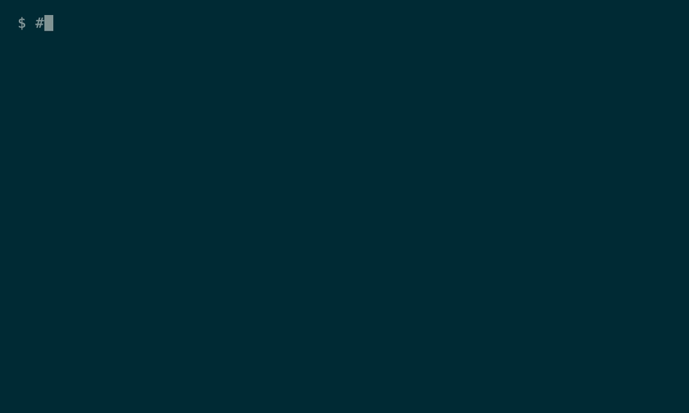

# apple-rec — `rec`

Record your **screen and your Mac's audio at once**, from the terminal, with **no
loopback driver** — no BlackHole, no Loopback, no "route the speakers into the
microphone" hack.

```bash
rec
```

That's it. It starts recording the whole screen **+ all system audio** immediately and
saves `./yyyy-MM-dd-HH-mm-ss.mov` **in the folder you ran it from**. Press **Ctrl-C** (or
type `q` + Enter) to stop and finalize.

<!-- Demo GIF goes here once generated — see "Demo" below. Uncomment when demo.gif exists:

-->

## Why this exists

macOS's built-in recorders — QuickTime Player and the ⌘⇧5 Screenshot toolbar — only
offer a **microphone** picker. Apple omits system-audio capture from the built-in
recorder **on purpose**, which is why everyone reaches for a virtual-audio-device hack
(BlackHole/Loopback) that pretends to be a microphone.

But the capability ships in the OS: **ScreenCaptureKit**'s
`SCStreamConfiguration.capturesAudio` pulls audio **straight off the system audio
engine**, and an app-scoped `SCContentFilter` can capture **only one app's sound**. This
is a ~300-line Swift CLI that surfaces exactly that. Apple-frameworks only — no Homebrew,
no dependencies.

## Install & build

```bash
git clone https://github.com/esaruoho/apple-rec.git
cd apple-rec
./build.sh                            # compile the Swift sources → local binaries
ln -s "$PWD/rec" /usr/local/bin/rec   # optional: put `rec` on your PATH
```

`rec` also auto-builds on first run, so `./rec` works straight after clone.

### What ships vs. what you build

This repo is **source-only** — the compiled binaries are **not** committed (they're
arch-specific and unsigned; you build them locally). `./build.sh` produces three from the
tracked `.swift` sources:

| Binary | Source | What it is |
|---|---|---|
| `screen-audio-record` | `screen-audio-record.swift` | the recorder (ScreenCaptureKit) |
| `rec-audio` | `rec-audio.swift` | split / flatten audio tracks |
| `rec-subtitle` | `rec-subtitle.swift` | Whisper `.srt` + burn-in |

`rec` is a small shell wrapper (checked in) that calls `screen-audio-record`. All four live
in the same folder so the recorder can find its helpers.

### Requirements

- **macOS 13+** (Ventura) for the recorder; `--mic` / live mic toggle need **macOS 15+**
  (Sequoia). No Homebrew, no dependencies for recording — Apple frameworks only.
- **Xcode command-line tools** for `swiftc` (`xcode-select --install`).
- **Subtitles only** (`rec-subtitle`) need the third-party [openai-whisper](https://github.com/openai/whisper)
  CLI + `ffmpeg`: run **`./install-deps.sh`** once (`pip install openai-whisper`). Everything
  else — recording, per-app audio, flatten, webcam PiP, subtitle burn-in — is Apple-native.

### First-run permission

macOS asks for **Screen Recording** permission for your terminal on first run — approve it
(System Settings ▸ Privacy & Security ▸ Screen Recording). `--pip` also asks for **Camera**.
macOS Sequoia re-asks Screen Recording weekly / after reboot — an OS policy the tool can't
suppress.

## Usage

```bash
rec                      # whole screen + ALL system audio → ./<timestamp>.mov
rec --app Renoise        # screen + ONLY that app's audio (nothing else leaks in)
rec --mic                # start with your microphone recording too (2nd audio track)
rec --reveal             # reveal + select the finished file in Finder on stop
rec --out ~/demo.mov     # custom output path
rec --list               # list displays + audible running apps (for --app)
```

- **Stop** a terminal recording with **Ctrl-C** (or type **`q`** + Enter) — it catches the
  signal and finalizes the `.mov`, then prints the **final recording length** and whether the
  mic was recorded. Do not re-run `rec` to stop (that starts a second recording). On start it
  also states plainly whether the **microphone is ON**.
- **Toggle the mic on/off mid-recording** without stopping: send the process `SIGUSR1`,
  e.g. `kill -USR1 $(pgrep -n screen-audio-record)`. The mic goes to its own track, so
  muting just stops writing mic samples. Start muted (default) or hot (`--mic`).
- `--app <name>` overrides `--system-audio` — single-app audio wins.
- Output is one `.mov`: **H.264** video + **AAC** audio (a **2nd AAC track** for the mic
  when used), muxed via `AVAssetWriter`.

### Recording both system audio and the mic — and the YouTube trap

Pass `--mic` (or toggle it on live). System audio and the microphone are captured as **two
separate audio tracks** in the same `.mov` — so Final Cut / Premiere / DaVinci can balance
them independently.

**⚠️ YouTube and QuickTime play only the FIRST audio track.** Upload a raw 2-track recording
and your **voice (track 2) is silently dropped**. So `rec --mic` **also writes a
`<name>-flat.mov`** with system + mic **mixed into one track** — that's the file you upload.
(iMovie can't split embedded tracks either; see `rec-audio` below.)

### `rec-audio` — post-process for editing

```bash
rec-audio split   recording.mov            # → recording-system.m4a + recording-mic.m4a
rec-audio flatten recording.mov [-o out]   # → recording-flat.mov (video + one mixed track)
```

- **`split`** extracts each audio stream to its own `.m4a`. **iMovie recipe:** import the
  `.mov` (video + system audio), then drag `recording-mic.m4a` onto the timeline as a second
  audio track — now you can balance voice vs app sound independently.
- **`flatten`** mixes system + mic into one track on a video-**passthrough** `.mov` (no
  re-encode, no quality loss) via `AVAssetReaderAudioMixOutput`. Plays both everywhere —
  QuickTime, iMovie, YouTube. This is what `--auto-flatten` runs for you.

### `rec-subtitle` — Whisper `.srt` + burn-in

```bash
rec-subtitle recording.mov            # → recording.srt (upload to YouTube as captions)
rec-subtitle recording.mov --burn     # → recording-subtitled.mov (subtitles painted in)
```

- **Sidecar:** transcribes the audio to `recording.srt`. Upload the video + this `.srt` as a
  caption track. `--mic recording-mic.m4a` transcribes the voice-only track for a cleaner result.
- **`--burn`:** hard-paints the subtitles into a new `-subtitled.mov` — Apple-native
  `AVVideoCompositionCoreAnimationTool`, white text + black outline, bottom-center, timed per cue.
- **Transcription** is the one feature that needs a 3rd-party tool (the openai-whisper
  `whisper` CLI). Install it once: **`./install-deps.sh`** (runs `pip install openai-whisper`
  + checks ffmpeg). `--model tiny|base|small|medium|large-v3` trades speed for accuracy
  (default `base`). Everything else — recording, PiP, flatten, burn-in — is Apple-native, no deps.

### One command — the whole pipeline

```bash
rec --mic --pip --burn      # record (screen + system + mic + webcam circle) → on Ctrl-C:
                            # flatten (YouTube) + transcribe + burn subtitles, all in one go
```

### Direct binary

`rec` is a thin wrapper over `screen-audio-record`, which you can call directly for full
control (e.g. `--system-audio` vs `--app`, `--display <n>`, `--fps <n>`):

```bash
./screen-audio-record --list
./screen-audio-record --app Renoise --out ~/take.mov
./screen-audio-record --system-audio --fps 30 --out ~/take.mov
```

## How it works

- `SCContentFilter` selects the display, or the display **including a single application**
  (for per-app audio isolation).
- `SCStreamConfiguration`: `capturesAudio = true`, `excludesCurrentProcessAudio = true`,
  48 kHz stereo; optional `captureMicrophone = true` (macOS 15+ native mic, no
  `AVCaptureSession`).
- An `SCStream` delivers `.screen` (BGRA frames), `.audio`, and optionally `.microphone`
  sample buffers, which are appended to an `AVAssetWriter` (`.mov`, H.264 + AAC).
- **Ctrl-C** (`SIGINT`) is handled by a `DispatchSource` that stops capture, marks the
  writer inputs finished, and finalizes the file.

## Demo

The banner at the top is a **recorded-terminal GIF** — an animated capture of the terminal
running `rec`, so a visitor sees what the tool does in two seconds without reading a word. It's
generated deterministically (not by screen-capturing a live session) with
[charmbracelet/vhs](https://github.com/charmbracelet/vhs), which types the commands in a
headless terminal and renders the GIF:

```bash
brew install vhs
./build.sh          # so ./rec exists
vhs demo.tape       # → demo.gif  (then uncomment the image tag near the top of this README)
```

The script lives in [`demo.tape`](demo.tape) — edit it to change what the demo shows.

## License

MIT — see [LICENSE](LICENSE).

---

Mirror of `bin/screen-audio-record` + `bin/rec` from
[esaruoho/apple](https://github.com/esaruoho/apple). The standalone repo is canonical on
divergence.
